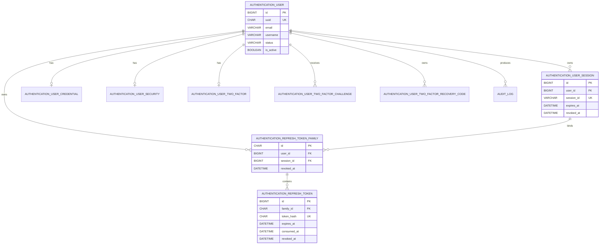

# Entity Relationship Diagram

The following Mermaid ERD records the security-critical relationships confirmed by the current Prisma schema. It intentionally does not invent relationships for scaffolded or unreviewed tables.

`AuthenticationRefreshToken.token_hash` is the persisted representation of the opaque credential; the plaintext token is not an entity field.
