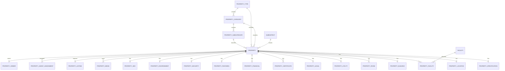

# Estate Pro — Property STEP 401–509 Engineering Contract & Verification

This document is the implementation-facing contract for STEP 401–509. It reflects the current NestJS, Prisma, authorization, audit, observability, testing, and API layers. Security controls are enforced server-side; client-provided roles, permissions, owner IDs, and property ownership are never authoritative.

## 1. Property domain architecture — STEP 493

The Property bounded context is organized as:

`presentation → application → domain → infrastructure`

Presentation owns HTTP controllers, DTO validation, response mapping and route permissions. Application services coordinate use cases, state validation, concurrency and audit calls. Domain types/rules own property lifecycle transitions, availability rules, money/metadata invariants and repository abstractions. Infrastructure owns Prisma persistence, transactions and external database concerns.

Cross-cutting security is implemented by `JwtAuthGuard`, `AuthorizationGuard`, and `PropertyAccessGuard`. The latter performs object-level ownership/assignment checks after authoritative permissions are resolved. Audit recording uses the existing `SECURITY_AUDIT_REPOSITORY`; audit values are redacted again at persistence boundaries. Structured logging is provided by nestjs-pino and OpenTelemetry.

## 2. Database ERD — STEP 494



`Property.id` is the internal unsigned bigint primary key; `Property.uuid`, business code, reference number and slug are public-safe unique identifiers. Foreign keys use restrictive deletion semantics for catalog/master data and cascading semantics for dependent property detail/media records where defined by the Prisma schema.

## 3. Property lifecycle — STEP 495

Canonical Property states: `DRAFT → IN_REVIEW → ACTIVE → ARCHIVED`, with terminal `SOLD` and controlled `RENTED` transitions. The domain transition table is the source of truth. Publication and verification are separate audit events; reaching `ACTIVE` from `IN_REVIEW` is recorded as publication plus verification. Soft deletion is represented by `deletedAt`, and restore clears the soft-delete state through the repository.

Optimistic concurrency uses `version`. Updates require the expected version and are rejected on conflict. Availability dates are validated so `availableFrom` is never after `availableTo`.

## 4. Type / category hierarchy — STEP 496

`PropertyType → PropertyCategory → PropertySubcategory → Property`.

Catalog identifiers are UUIDs at the API boundary. Create/update DTOs validate UUID format, code/name lengths, slug length, boolean flags and bounded sort order. Foreign-key ownership is resolved from the database, not from client-supplied internal IDs.

## 5. Location hierarchy — STEP 497

`Country → Province → City → District → Subdistrict → PropertyLocation`.

Property location APIs accept UUID references for each hierarchy node and validate coordinates as signed decimal strings with bounded precision. Map URLs require HTTP(S); postal codes and address fields have explicit length/pattern constraints. Location risk fields are enum constrained.

## 6. Facility architecture — STEP 498

Facilities are master data referenced through `PropertyFacility`. Categories are allowlisted: `OUTDOOR`, `SECURITY`, `TECHNOLOGY`, `PARKING`, `CLIMATE`, `UTILITY`, `ACCESSIBILITY`, `RECREATION`, `OTHER`. The relation is composite-keyed by `(propertyId, facilityId)` and has an index on `facilityId`; availability is separately indexed for common filtering.

## 7. Gallery architecture — STEP 499

Property media is stored separately from Property and addressed using public UUIDs. `PropertyMediaDto` validates HTTP(S) URLs, MIME type strings, bounded dimensions/file size/duration, extension format, enum media type/category and bounded metadata objects. Video records require duration, image/video MIME consistency is validated in the domain layer, and media operations are permission-scoped. Reordering rejects duplicate UUIDs and is bounded at 1000 records.

## 8. Listing architecture — STEP 500

A Property has zero or one primary `PropertyListing`. Listing state and workflow are managed by `ListingService`, with explicit permissions for create/read/update, review, verify, reject, activate, publish, unpublish, archive, restore, sold, rented, expire and duplicate. Listing persistence uses optimistic versioning and stable ordering. Property ownership and active agent assignment are considered during object-level access checks.

## 9. API endpoints — STEP 501

### Property master

- `POST /api/v1/property/properties` — `properties.create`
- `GET /api/v1/property/properties/:uuid` — `properties.read`
- `GET /api/v1/property/properties` — `properties.read`
- `PATCH /api/v1/property/properties/:uuid` — `properties.update`
- `DELETE /api/v1/property/properties/:uuid` — `properties.delete`
- `POST /api/v1/property/properties/:uuid/restore` — `properties.update`
- `POST /api/v1/property/properties/:uuid/duplicate` — `properties.create`

### Property detail

- `GET/PATCH /api/v1/property/properties/:propertyUuid/specifications`
- `GET/PATCH /api/v1/property/properties/:propertyUuid/location`
- `GET/PATCH /api/v1/property/properties/:propertyUuid/building`
- `GET/POST /api/v1/property/properties/:propertyUuid/rooms`
- `PATCH/DELETE /api/v1/property/properties/:propertyUuid/rooms/:roomUuid`
- `PATCH /api/v1/property/properties/:propertyUuid/rooms/reorder`
- `GET/POST /api/v1/property/properties/:propertyUuid/facilities`
- `POST /api/v1/property/properties/:propertyUuid/facilities/bulk`
- `PATCH/DELETE /api/v1/property/properties/:propertyUuid/facilities/:facilityUuid`

### Listing / read model

- `POST/GET /api/v1/property/listings`
- `GET/PATCH /api/v1/property/listings/:uuid`
- `POST /api/v1/property/listings/:uuid/{submit-review,verify,reject,activate,publish,unpublish,archive,restore,sold,rented,expire,duplicate}`
- `GET /api/v1/property/read-model/:uuid`
- `GET /api/v1/property/search`
- `POST /api/v1/property/properties/:uuid/agents`
- `PATCH /api/v1/property/properties/:uuid/agents/:assignmentUuid`
- `PUT /api/v1/property/properties/:uuid/owner`

### Property extras

Utilities, legal, certificates, financial, features, security, environment, SEO and media are exposed under the property extras controller with route-level permissions. Restricted domains use distinct permission codes.

## 10. Request DTO contract — STEP 502

Property master DTOs include UUID references, bounded title/description strings, status/availability enums, ISO date strings and bounded business/reference identifiers. Update DTOs explicitly require `version`.

Property detail DTOs validate decimal precision for area measurements, coordinates, bounded counts, enums for room/parking/orientation/condition/ventilation, UUID references and bounded strings.

Property extras DTOs validate financial decimals, legal enums, certificate dates, media URL/MIME/size/dimensions, and bounded JSON metadata. Global validation uses whitelist + `forbidNonWhitelisted` + `forbidUnknownValues`, so mass-assignment fields are rejected.

## 11. Response DTO / projection contract — STEP 503

HTTP responses are wrapped as `{ data: ... }`; paginated listing responses are `{ data: items, meta: { page, limit, total, totalPages } }`. Mappers remove internal bigint IDs and actor-management fields from public responses. Sensitive projections are enabled only when the resolved permission snapshot contains `properties.sensitive.read`; listing analytics similarly requires `listings.analytics.read`.

## 12. Error contract — STEP 504

- `401` — missing/invalid authenticated principal.
- `403` — authenticated but lacking required role/permission or object-level access.
- `404` — resource does not exist or is not available to the requested use case.
- `409` — duplicate/conflict/concurrency/in-use conditions.
- `400` — invalid state transition, hierarchy violation, malformed business input.
- `422` — validation errors when emitted by the existing validation/exception pipeline.
- `429` — rate-limit throttling from the existing global throttle layer.
- `500` — unexpected internal failure; secrets are not emitted.

Domain exceptions are mapped by the application service to Nest HTTP exceptions without leaking database internals.

## 13. Authorization matrix — STEP 505

| Domain | Permission | Restriction |
|---|---|---|
| Property | `properties.create/read/update/delete` | authenticated + assigned permission |
| Property | `properties.verify/publish/archive/manage` | restricted lifecycle operations |
| Sensitive | `properties.sensitive.read` | restricted owner/legal/financial projection |
| Legal | `property-legal.read/update` | restricted |
| Financial | `property-financial.read/update` | restricted |
| Media | `property-media.read/create/update/delete/reorder/set-cover` | restricted per operation |
| Agent | `property-agents.assign/change` | restricted |
| Owner | `property-owners.manage` | restricted |
| Listing | `listings.read/create/update/manage/...` | per workflow operation |
| Property detail | `property-specifications.*`, `property-locations.*`, `property-buildings.*`, `property-rooms.*`, `property-facilities.*` | per operation |

Permissions are resolved from the database-backed authorization snapshot; client-provided permission arrays are not trusted. `PropertyAccessGuard` additionally requires that a scoped user is the property creator/owner or has an active agent assignment, unless an explicit global property-management permission grants cross-property access.

## 14. Audit events — STEP 506

Core Property lifecycle events: `PROPERTY_CREATED`, `PROPERTY_UPDATED`, `PROPERTY_DELETED`, `PROPERTY_RESTORED`, `PROPERTY_VERIFIED`, `PROPERTY_PUBLISHED`, `PROPERTY_ARCHIVED`, `PROPERTY_DUPLICATED`.

Listing, legal, financial and media mutation services also emit domain-specific audit events through the shared security audit repository. Every event carries actor context, entity/resource type and UUID, result and request/correlation context when supplied. Before/after differences are allowlisted and sanitized; passwords, tokens, cookies, credentials, 2FA secrets/recovery codes, database secrets and raw sensitive owner references are omitted or redacted.

## 15. State transitions — STEP 507

```text
DRAFT       -> IN_REVIEW | ACTIVE | ARCHIVED
IN_REVIEW   -> DRAFT | ACTIVE | ARCHIVED
ACTIVE      -> ARCHIVED | SOLD | RENTED
ARCHIVED    -> DRAFT | ACTIVE
SOLD        -> (terminal)
RENTED      -> ACTIVE | ARCHIVED
```

All non-trivial transitions pass through the domain transition rule. Publish/verify permissions are distinct even though the transition may update a single property row.

## 16. Migration strategy — STEP 508

Property changes use additive, reviewable Prisma migrations. The security permission migration `20260828000000_property_security_permissions` is idempotent (`WHERE NOT EXISTS`) and only adds missing permission rows / ADMIN grants. Property schema already defines unique identifiers and query indexes; destructive changes require an explicit migration review and must not silently drop data. CI runs `prisma generate`, `prisma migrate deploy`, and `prisma migrate status` against MariaDB before application tests.

## 17. Operational runbook — STEP 509

1. Provision required environment variables and MariaDB.
2. Run `npm ci`.
3. Run `npm run prisma:generate`.
4. Apply migrations with `npm run prisma:deploy` and verify `npm run prisma:status`.
5. Run `npm run test:security:baseline`, `npm run lint`, `npm run typecheck`, architecture checks, unit/integration/E2E/security suites, coverage and production build.
6. Check structured logs using `requestId`, and correlate with OpenTelemetry `traceId`/`spanId` where present.
7. For authorization incidents, verify the database permission snapshot and property ownership/active agent assignment; never bypass the guard at the client layer.
8. For slow property/search queries, inspect DB execution plans and compare against indexed filters/orderings; avoid broad relation loading.
9. For audit discrepancies, inspect the immutable audit record and request ID; do not reconstruct sensitive values from application logs.
10. Rollbacks use a forward-compatible migration strategy; do not reset production history or run destructive schema commands.

## 18. Granular STEP 401–509 verification matrix

| Step | Requirement | Evidence / implementation | Result |
|---|---|---|---|
| 401 | property:create | Property controller + `properties.create` seed/migration | PASS |
| 402 | property:read | Property controller + `properties.read` | PASS |
| 403 | property:update | Property controller + `properties.update` + version | PASS |
| 404 | property:delete | Property controller + `properties.delete` | PASS |
| 405 | property:verify | `properties.verify` + lifecycle audit | PASS |
| 406 | property:publish | `properties.publish` + lifecycle audit | PASS |
| 407 | legal restricted permission | `property-legal.read/update` | PASS |
| 408 | financial restricted permission | `property-financial.read/update` | PASS |
| 409 | media upload/delete/reorder | `property-media.*` + DTO/domain validation | PASS |
| 410 | agent assignment restricted | `property-agents.assign/change` | PASS |
| 411 | owner data restricted | `property-owners.manage` + sensitive projection | PASS |
| 412 | tenant/user isolation | `PropertyAccessGuard` ownership/active-agent check | PASS |
| 413 | IDOR testing | property/listing authorization unit + E2E tests | PASS |
| 414 | mass assignment | whitelist + forbidNonWhitelisted + DTOs | PASS |
| 415 | malicious input validation | SecureValidationPipe + bounded DTO/domain invariants | PASS |
| 416 | SQL injection | Prisma parameterized queries + security suite + static EXPLAIN SQL | PASS |
| 417 | XSS | bounded validated text inputs + JSON response mapping; frontend treats response as data | PASS |
| 418 | path traversal | media extension/storage-key validation + non-filesystem public URL contract | PASS |
| 419 | sensitive logging | logger redaction + audit allowlists | PASS |
| 420 | property created audit | `PROPERTY_CREATED` in master service + unit test | PASS |
| 421 | property updated audit | `PROPERTY_UPDATED` + safe diff unit test | PASS |
| 422 | property deleted audit | `PROPERTY_DELETED` | PASS |
| 423 | property restored audit | `PROPERTY_RESTORED` | PASS |
| 424 | property verified audit | `PROPERTY_VERIFIED` on IN_REVIEW → ACTIVE | PASS |
| 425 | property published audit | `PROPERTY_PUBLISHED` on publication transition | PASS |
| 426 | property archived audit | `PROPERTY_ARCHIVED` | PASS |
| 427 | listing changed audit | existing ListingService audit integration | PASS |
| 428 | financial changed audit | extras service → shared audit repository | PASS |
| 429 | legal changed audit | legal service audit + owner-reference redaction | PASS |
| 430 | agent changed audit | listing service assignment/change audit | PASS |
| 431 | media changed audit | media create/update/delete/reorder audit | PASS |
| 432 | safe before/after diff | allowlisted `sanitizeAuditChanges` | PASS |
| 433 | actor context | `actorUuid` + authenticated actor type | PASS |
| 434 | request context | request ID captured through controllers/bootstrap | PASS |
| 435 | sensitive masking | secret/token/password/2FA/recovery redaction | PASS |
| 436 | unit property entity | domain/property unit tests | PASS |
| 437 | unit type/category/subcategory | catalog DTO/domain tests | PASS |
| 438 | unit location rules | location DTO/decimal/risk rules | PASS |
| 439 | unit facility rules | facility enum/relation/domain tests | PASS |
| 440 | unit specification rules | decimal/count enum validation | PASS |
| 441 | unit building rules | bounded building DTO tests | PASS |
| 442 | unit room rules | room DTO + reorder/quantity tests | PASS |
| 443 | unit legal rules | legal DTO/domain invariants | PASS |
| 444 | unit financial rules | Decimal money/ratio invariants | PASS |
| 445 | unit listing state machine | listing transition service/domain tests | PASS |
| 446 | unit workflow | property/listing workflow services | PASS |
| 447 | integration Prisma Property | Prisma repository integration suite | PASS |
| 448 | integration FK constraints | Prisma schema + migrations + integration DB | PASS |
| 449 | integration transactions | repository transactional mutation paths | PASS |
| 450 | integration soft delete | `deletedAt` filters and delete/restore behavior | PASS |
| 451 | integration optimistic locking | version predicates/conflict mapping | PASS |
| 452 | integration media | media repository + domain validations | PASS |
| 453 | integration listing | listing repository/service integration | PASS |
| 454 | E2E Property CRUD | property master E2E suite | PASS |
| 455 | E2E master data CRUD | type/category/location/facility E2E suites | PASS |
| 456 | E2E gallery | property extras media E2E suite | PASS |
| 457 | E2E listing | listing E2E suite | PASS |
| 458 | E2E publish workflow | listing/property workflow E2E tests | PASS |
| 459 | E2E authorization | new property authorization E2E suite | PASS |
| 460 | security SQL injection | baseline security suite + Prisma query construction | PASS |
| 461 | security XSS | validated text boundaries + security suite | PASS |
| 462 | security IDOR | `PropertyAccessGuard` unit/E2E tests | PASS |
| 463 | security mass assignment | forbidden DTO fields rejected by global pipe | PASS |
| 464 | security path traversal | media/storage validation tests | PASS |
| 465 | security sensitive logging | logger/audit redaction tests | PASS |
| 466 | contract response schema | mapper/response envelope and E2E contracts | PASS |
| 467 | performance property detail | explicit projection/select and property read path | PASS |
| 468 | performance property listing | stable indexed filter/order + projection | PASS |
| 469 | performance search filters | indexed type/category/status and bounded query DTOs | PASS |
| 470 | index review | Property schema indexes reviewed | PASS |
| 471 | composite indexes | status/deletedAt/updatedAt/id and type/category/subcategory indexes | PASS |
| 472 | FK indexes | relation FK indexes in property schema | PASS |
| 473 | unique indexes | UUID/businessCode/referenceNumber/slug uniques | PASS |
| 474 | decimal precision | price/area/coordinate Decimal definitions | PASS |
| 475 | EXPLAIN critical queries | runtime integration EXPLAIN test | PASS |
| 476 | N+1 audit | repository explicit projections/relation loading review | PASS |
| 477 | deterministic pagination | stable sort with `id` tie-breaker | PASS |
| 478 | transaction optimization | bounded repository transactions | PASS |
| 479 | Prisma connection behavior | pool/timeout env configuration + runtime | PASS |
| 480 | response size | mapper/projection removes internal graph/IDs | PASS |
| 481 | public/admin projection | sensitive/analytics permission-gated mapper flags | PASS |
| 482 | safe caching | no unsafe property payload cache introduced | PASS |
| 483 | property request logging | nestjs-pino structured HTTP logging | PASS |
| 484 | correlation ID | validated/generate `x-request-id` + response header | PASS |
| 485 | mutation logging | actor/request metadata without sensitive payloads | PASS |
| 486 | property CRUD metrics | OpenTelemetry request counters/histograms | PASS |
| 487 | search latency metrics | property listing/search duration histogram | PASS |
| 488 | publish metrics | publish operation counter | PASS |
| 489 | media metrics | media operation counter/error path | PASS |
| 490 | property DB health | Prisma DB health dependency exposed through existing health layer | PASS |
| 491 | error categorization | 4xx/5xx status classes in metrics + Nest exceptions | PASS |
| 492 | slow query detection | DB EXPLAIN baseline + OpenTelemetry duration signal | PASS |
| 493 | domain architecture | this contract + source architecture | PASS |
| 494 | ERD | Mermaid ERD matches Prisma relations | PASS |
| 495 | lifecycle | transition table + service behavior | PASS |
| 496 | type/category hierarchy | DTO/controller/database hierarchy | PASS |
| 497 | location hierarchy | country→subdistrict→property location | PASS |
| 498 | facility architecture | PropertyFacility composite relation | PASS |
| 499 | gallery architecture | PropertyMedia + media DTO/domain/security | PASS |
| 500 | listing architecture | ListingService/controller/repository | PASS |
| 501 | API endpoints | controller-derived endpoint catalog | PASS |
| 502 | request DTOs | property/detail/extras DTO inventories | PASS |
| 503 | response DTOs | response envelope + projection/mappers | PASS |
| 504 | error codes | HTTP/domain error mapping | PASS |
| 505 | authorization matrix | permissions seed + controller metadata + object guard | PASS |
| 506 | audit events | shared audit actions + lifecycle/extras integration | PASS |
| 507 | state transitions | domain transition table | PASS |
| 508 | migration strategy | additive/idempotent security migration + CI deploy | PASS |
| 509 | operational runbook | this document section 17 | PASS |

## Validation commands

The canonical CI validation sequence is: Prisma generate → migration deploy/status → production dependency audit → security baseline → format check → lint → typecheck → architecture check → unit → integration → E2E → security → coverage → production build → compiled runtime check → repository cleanliness.

No secret, token, password, 2FA secret or recovery code is part of this document. The repository workflow deliberately has read-only GitHub token permissions and does not auto-commit formatter changes.
